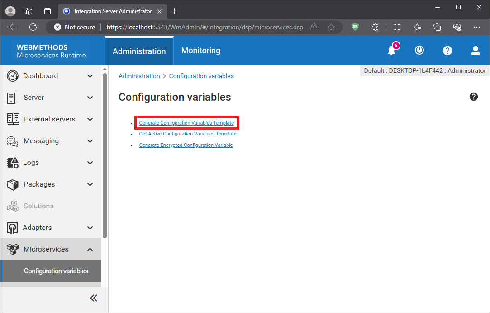

# Webmethods with Kubernetes

This is an example repository on how to manage and orchestrate a git repository where the code is to be deployed into a kubernetes environment.

## How to run...

⚠️ To run the follwoing commands you need to install docker on your machine.

1. Add your packages and configurations to the respective folders.
2. Generate the application.properties and substitute the values with the desired configuration.
3. Build the image locally in for your docker machine.
4. Edit the docker-compose.yaml file with your image.
5. Run the docker compose up command to run a container with your microservices runtime.

To build the container image use the following command:
```
docker image build -t <your_username>/wm-msr-demo:10.15 .
```

To run the container use the following command:
```
docker compose up -d
```

At the 📄docker-compose.yaml file change the image name with the corresponding name of your image:

```
image: "<your_username>/wm-msr-demo:10.15"
```

## Folder Structure

* 📁 **documentation** → Necessary and suplementar documentation for the project.
* 📁 **k8s** → Configuration for kubernetes environment.
* 📁 **config** → Configuration files for microservices runtime (Integration Server configurations).
* 📁 **packages** → Packages as a simple folder.
* 📄 **application.properties** → Configuration for the microservices runtime environment. (Refer to [this section](#how-to-generate-application.properties) on how to generate the application.properties)

Docker files:

* 📄 **Dockerfile** → Docker description file on how to build the microservices runtime container with the custom code and configurations.
* 📄 **docker-compose.yaml** → Docker description file on how to run the container.
* 📄 **.env** → Environment variables for the container.

### How to generate 📄 _application.properties_ <a name="how-to-generate-application.properties"></a>

To genereta a template for this file go to your administrator console for Integration Server and at the tab Microservices → Configuration Variablles select the option ```Generate Configuration Variables Template``` as shown in the figure:



## Kubernetes setup

In order to get your generated microservices runtime image in kubernetes you need to push the image to your Docker Hub repository and setup the credentials in your kubernetes environment.

```
kubectl create secret docker-registry regcred --docker-server=<registry_server> --docker-username=<your_username> --docker-password=<your_password> --docker-email=<your_email> --namespace <your_namespace>
```

| Property | Description |
|-|:-|
| registry_server | Set with the url of your registry server. For Docker Hub use: https://index.docker.io/v1/ |
| your_username | Set this value with your username for the registry that you are using. |
| your_password | Set this value with that password for the user that you set up at your registry. |
| your_email | Optionally you can set this value with the email you are using. If you are using Docker Hub is recommend to setup this value. |
| your_namespace | Set this value with the k8s namespace where this docker registry credentials are to be used. |

